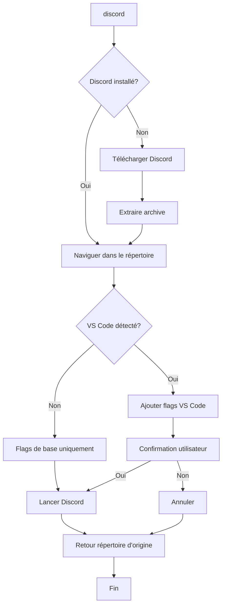

# 🎧 Discord Portable - Guide Complet

## 🎯 Vue d'ensemble

La fonctionnalité Discord du 42_ZSH Student Helper permet d'installer et lancer Discord automatiquement dans l'environnement temporaire `/tmp/tmp/discord`, économisant ainsi l'espace sur votre session utilisateur.

## 🚀 Installation et utilisation

### Commande de base

```bash
discord
```

Cette commande unique :

1. 📥 **Télécharge** Discord si absent
2. 📦 **Extrait** l'archive automatiquement
3. 🚀 **Lance** Discord avec les flags appropriés
4. 📁 **Revient** au répertoire d'origine

### Première utilisation

```bash
$ cd ~/Documents
$ discord
📥 Téléchargement de Discord...
✅ Téléchargement réussi
📦 Extraction...
✅ Extraction réussie
🚀 Lancement de Discord...
✅ Discord installé et lancé en arrière-plan
$ pwd
/home/username/Documents  # Vous êtes revenus au point de départ !
```

## 🔧 Versions disponibles

### 1. `discord()` - Version principale (Recommandée)

**Caractéristiques :**

- ✅ Utilise des arrays Zsh pour une gestion robuste des flags
- ✅ Compatible avec toutes les versions de nohup
- ✅ Gestion d'erreurs complète

**Utilisation :**

```bash
discord
```

### 2. `discord_eval()` - Version alternative

**Caractéristiques :**

- ✅ Utilise `eval` pour forcer l'expansion des variables
- ✅ Solution de fallback si problèmes avec les arrays
- ✅ Même fonctionnalités que la version principale

**Utilisation :**

```bash
discord_eval
```

### 3. `discord_pushd()` - Version avec pile de répertoires

**Caractéristiques :**

- ✅ Utilise `pushd`/`popd` pour la gestion des répertoires
- ✅ Plus robuste en cas d'interruption
- ✅ Gestion automatique de la pile de répertoires

**Utilisation :**

```bash
discord_pushd
```

## 🎨 Compatibilité VS Code

### Détection automatique

La fonction détecte automatiquement si elle est lancée depuis VS Code en vérifiant :

```bash
VSCODE_INJECTION          # Variable d'injection VS Code
TERM_PROGRAM=vscode       # Terminal intégré VS Code
VSCODE_PID                # PID du processus VS Code
TERMINAL_EMULATOR=vscode  # Émulateur terminal
VSCODE_IPC_HOOK           # Hook de communication VS Code
```

### Flags de compatibilité

**Flags de base (tous environnements) :**

```bash
--no-sandbox              # Désactive le sandbox
--disable-dev-shm-usage   # Évite les problèmes de mémoire partagée
```

**Flags spéciaux VS Code :**

```bash
--disable-gpu-sandbox                    # Désactive le sandbox GPU
--disable-features=VizDisplayCompositor  # Désactive le compositeur d'affichage
```

### Confirmation VS Code

Quand VS Code est détecté, la fonction demande confirmation :

```bash
⚠️  VS Code détecté - Application de flags de compatibilité
💡 Des flags spéciaux seront utilisés pour éviter les conflits
🤔 Continuer le lancement de Discord dans VS Code ? [y/N]:
```

## 🛠️ Outils de debug

### Alias de diagnostic

```bash
discord_debug    # Lance sans détection VS Code
discord_force    # Affiche les erreurs détaillées
discord_minimal  # Version basique sans flags
discord_test     # Test avec feedback complet
```

## 🐛 Résolution de problèmes

### Problème : "trace trap (core dumped)"

**Cause :** Conflit entre flags VS Code  
**Solutions :**

1. Essayer la version eval :

```bash
discord_eval
```

2. Utiliser la version pushd :

```bash
discord_pushd
```

3. Désactiver la détection VS Code :

```bash
discord_debug
```

### Problème : Discord ne se lance pas

**Diagnostic :**

1. Activer les logs de debug :

```bash
log_debug
discord
```

2. Vérifier avec la version force :

```bash
discord_force
```

3. Test minimal :

```bash
discord_minimal
```

### Problème : Reste dans /tmp/tmp/discord

**Cause :** Interruption de la fonction  
**Solution :** Revenir manuellement :

```bash
cd "$OLDPWD"  # Revenir au répertoire précédent
# ou
cd ~          # Revenir au home
```

### Problème : Permissions insuffisantes

**Diagnostic :**

```bash
ls -la /tmp/tmp/
```

**Solution :**

```bash
mkdir -p /tmp/tmp/discord
chmod 755 /tmp/tmp/discord
```

## 📊 Architecture technique

### Structure des répertoires

```
/tmp/tmp/discord/
├── discord.tar.gz          # Archive téléchargée
├── Discord/                 # Application extraite
│   ├── Discord              # Exécutable principal
│   ├── resources/           # Ressources de l'application
│   └── ...
```

### Flux d'exécution



### Gestion des erreurs

Chaque version gère les erreurs et garantit le retour au répertoire d'origine :

```bash
# En cas d'erreur à n'importe quelle étape
logs_error "❌ Description de l'erreur"
cd "$ORIGINAL_DIR"  # ou popd pour la version pushd
return 1
```

## 🔧 Personnalisation

### Variables d'environnement

```bash
# Désactiver la détection VS Code
export VSCODE_PID=""

# Forcer un répertoire Discord personnalisé (avancé)
DISCORD_DIR="/chemin/custom" discord
```

### Flags personnalisés

Pour ajouter des flags personnalisés, modifiez les arrays dans la fonction :

```bash
# Dans ~/.zshrc
local BASE_FLAGS=("--no-sandbox" "--disable-dev-shm-usage" "--your-custom-flag")
```

## 📈 Performance et optimisation

### Espace disque

- **Installation** : ~100MB dans `/tmp/tmp/discord`
- **Économie** : 100MB économisés sur la session utilisateur
- **Nettoyage** : Automatique au redémarrage (`/tmp` est vidé)

### Temps de lancement

- **Première fois** : ~10-30 secondes (téléchargement + extraction)
- **Fois suivantes** : ~2-5 secondes (lancement direct)

### Cache et persistance

Discord stocke ses données dans `/tmp/tmp/discord` :

- ✅ **Avantage** : Économie d'espace utilisateur
- ⚠️ **Attention** : Données perdues au redémarrage
- 💡 **Conseil** : Utilisez Discord Web pour les données importantes

## 🤝 Contribution

Pour améliorer la fonctionnalité Discord :

1. **Bugs** : Reportez les problèmes via GitHub Issues
2. **Améliorations** : Proposez des améliorations via Pull Request

### Zones d'amélioration

- Support d'autres applications Electron
- Intégration avec d'autres outils de communication

---

**💡 Astuce :** Utilisez `discord_test` pour vérifier que tout fonctionne correctement dans votre environnement !
